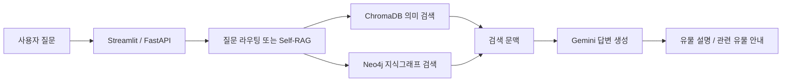

# HeritageKG Docent

문화유산 지식그래프와 벡터 검색을 결합한 **박물관 AI 도슨트 챗봇**입니다. 국립중앙박물관 소장품 데이터 2,560건을 바탕으로 유물 설명과 연관 유물 탐색을 지원하며, Gemini가 검색된 정보를 활용해 답변합니다.

Neo4j 기반 Graph RAG, ChromaDB 기반 의미 검색, LangGraph 기반 Self-RAG를 비교·확장하는 연구용 프로젝트입니다. Streamlit 대화 화면, FastAPI 서버, 그래프 구축 코드, 벡터 DB와 RAGAS 평가 자료를 포함합니다.

## 구성과 동작



- **Graph RAG**: 질문 의도를 분류하고 유물 정보·관계와 설명문을 검색해 답변합니다.
- **Hybrid Search**: 벡터 검색 결과를 Neo4j의 유물 관계 정보로 보강합니다.
- **Self-RAG**: 검색, 문서 평가, 질문 재작성, 답변 생성·평가를 LangGraph로 연결합니다.
- **최적화 실험**: 반복 질문 캐싱과 키워드 기반 1차 필터를 적용한 별도 Self-RAG 서버가 있습니다.
- **대화 UI**: Streamlit 채팅 화면과 관람객 유형별 프롬프트 정의를 제공합니다. 현재 Graph RAG 서버는 요청의 persona를 생성기에 전달하지 않아 기본 초보자 스타일을 사용합니다.

## 기술 스택

| 영역 | 구성 |
|---|---|
| 사용자 화면 | Streamlit |
| API | FastAPI, Uvicorn |
| LLM | Google GenAI SDK, 코드 설정 `gemini-2.5-flash` |
| 지식그래프 | Neo4j |
| 벡터 검색 | ChromaDB, `jhgan/ko-sroberta-multitask` |
| 워크플로 | LangGraph |
| 평가 | RAGAS, OpenAI 기반 평가 모델 |

## 파일 구조

```text
HeritageKG_Docent/
├── chatbot_app.py               # Streamlit 채팅 UI
├── graph_rag_api.py             # UI와 연결되는 Graph RAG API
├── api_graph_rag.py             # 별도 Graph RAG API 구현
├── api_self_rag.py              # Self-RAG API
├── api_self_rag_optimized.py    # 캐싱·문서 필터 최적화 버전
├── app.py                      # Graph RAG 실행 코드
├── self_rag_chatbot.py          # Self-RAG 워크플로
├── hybrid_search.py             # 벡터 검색 + 그래프 확장
├── neo4j_builder.py             # JSON → Neo4j 그래프 구축
├── graph/                      # 그래프 연결·검색·검증
├── vector_db/                  # 검색기, 구축 노트북, Chroma DB
├── llm/                        # Gemini 답변 생성기
├── router/                     # 질문 의도 분류
├── prompts/                    # 도슨트·스타일·평가 프롬프트
├── museum_collections.json     # 소장품 2,560건
├── evaluate_ragas.py           # Self-RAG 평가 실행
├── ragas_samples.json          # 평가 자료
├── ragas_result.csv            # 저장된 평가 결과 27행
├── requirements.txt
└── .env.example
```

## 설치와 환경 설정

저장소 루트에서 실행합니다. 벡터 DB 문서의 기록 환경은 Python 3.10이며, 실제 환경에 맞는 가상환경을 준비하세요.

```bash
python -m venv .venv
# Windows PowerShell
.venv\Scripts\Activate.ps1
python -m pip install -r requirements.txt
python -m pip install fastapi uvicorn requests
```

`requirements.txt`에는 API 실행에 필요한 일부 패키지가 빠져 있어 위 명령으로 추가합니다. 또한 루트의 고정 버전과 [벡터 DB 구축 환경 기록](vector_db/README.md)의 버전이 다릅니다. 기존 DB를 여는 과정에서 호환성 문제가 발생하면 구축 환경과 맞추거나 `vector_db/vector_db.ipynb`로 재구축해야 합니다. 전체 설치·서버 실행은 이번 저장소 정리 과정에서 검증하지 않았습니다.

```powershell
Copy-Item .env.example .env
```

생성된 `.env`에 자신의 Gemini API 키와 Neo4j 접속 정보를 입력합니다. `.env`는 Git에서 제외됩니다.

| 변수 | 용도 |
|---|---|
| `GEMINI_API_KEY` | Gemini 답변 생성 및 Self-RAG 평가 |
| `NEO4J_URI`, `NEO4J_USER`, `NEO4J_PASSWORD` | 직접 준비한 Neo4j 인스턴스 |
| `CHROMA_DB_DIR` | Self-RAG/Hybrid 검색의 로컬 DB 경로 |
| `COLLECTION_NAME` | `museum_relics` |
| `EMBEDDING_MODEL` | DB 구축 때와 동일한 임베딩 모델 |
| `DATA_FILE` | 그래프 구축용 JSON 경로 |
| `OPENAI_API_KEY` | RAGAS 평가를 실행할 때만 필요 |

Graph RAG의 `VectorRetriever`는 `vector_db/chroma_museum_db`를 코드 내 상대 경로로 사용하므로 루트에서 실행해야 합니다. Hybrid 검색의 기존 기본 경로는 다른 로컬 환경을 가리키므로 `.env.example`의 `CHROMA_DB_DIR` 설정을 사용하세요.

## 데이터베이스 준비

1. 자신의 Neo4j 인스턴스를 실행하고 `.env` 연결 정보를 설정합니다.
2. 다음 명령으로 소장품과 관계를 해당 데이터베이스에 적재합니다.

```bash
python neo4j_builder.py
```

이 명령은 연결된 Neo4j에 데이터를 기록합니다. Neo4j 서버 데이터 자체는 저장소에 포함되지 않습니다.

ChromaDB는 `vector_db/chroma_museum_db/`에 인덱스 전체가 포함되어 있습니다. SQLite 파일과 인덱스 디렉터리를 함께 유지하세요. 임베딩 모델은 최초 실행 시 별도 다운로드가 필요할 수 있습니다. 자세한 구조와 재구축 방법은 [벡터 DB README](vector_db/README.md)를 참고하세요.

## Graph RAG 챗봇 실행

첫 번째 터미널에서 API 서버를 실행합니다.

```bash
uvicorn graph_rag_api:app --host 127.0.0.1 --port 8000
```

두 번째 터미널에서 같은 가상환경을 활성화하고 UI를 실행합니다.

```bash
streamlit run chatbot_app.py
```

UI는 `http://localhost:8000`의 Graph RAG 서버에 연결됩니다. API 상태는 `/health`, 요청 스키마와 테스트 화면은 `/docs`에서 확인할 수 있습니다.

Graph RAG의 `POST /chat` 요청 예시:

```json
{
  "question": "청자에 대해 알려줘",
  "persona": "초보",
  "session_id": "demo"
}
```

## Self-RAG 실행

별도 API로 실행할 수 있습니다.

```bash
uvicorn api_self_rag_optimized:app --host 127.0.0.1 --port 8001
```

`POST /chat`의 요청 형식은 다음과 같습니다.

```json
{
  "query": "고려 청자의 특징을 알려줘",
  "chat_history": []
}
```

Graph RAG와 Self-RAG는 요청·응답 스키마가 다릅니다. 기존 Streamlit UI를 Self-RAG에 연결하려면 URL뿐 아니라 요청 및 응답 처리도 수정해야 합니다. 캐시와 세션은 프로세스 메모리에 저장되며, 운영 환경을 위한 별도 인증·영속 저장 설정은 포함되어 있지 않습니다.

## 평가 자료

[evaluate_ragas.py](evaluate_ragas.py)는 최적화 Self-RAG를 대상으로 context recall, faithfulness, factual correctness를 평가합니다. 추가 패키지와 `OPENAI_API_KEY`가 필요합니다.

```bash
python -m pip install ragas langchain-openai
python evaluate_ragas.py
```

[ragas_result.csv](ragas_result.csv)에 27행의 기존 평가 결과가 포함되어 있습니다. 오류 여부는 `error_type`과 각 지표의 결측값을 함께 확인하세요. 이 결과는 저장된 실험 기록이며, 이번 업로드 과정에서 재평가한 수치가 아닙니다. LLM 실행과 평가에는 외부 API 비용이 발생할 수 있습니다.

## 데이터와 공개 범위

소장품 JSON, 벡터 인덱스와 평가 자료를 포함합니다. 데이터의 이용·재배포 조건은 원 제공처의 조건을 확인하세요. 이 저장소에는 별도 라이선스 파일이 없습니다. 인증값은 `.env`에서 관리하며 코드에 직접 입력하지 마세요.
